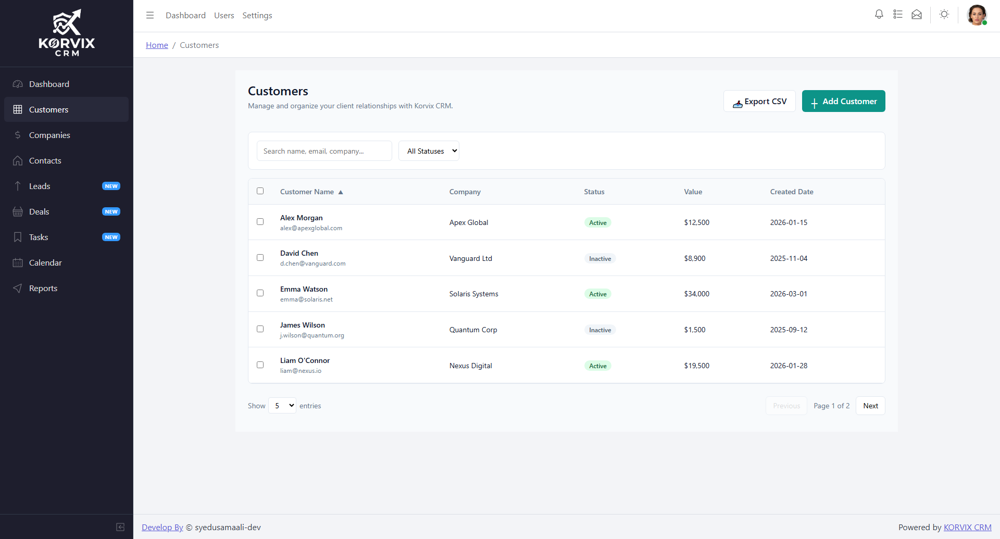
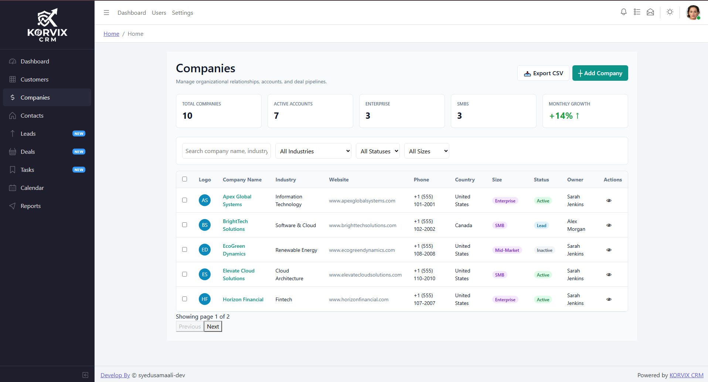
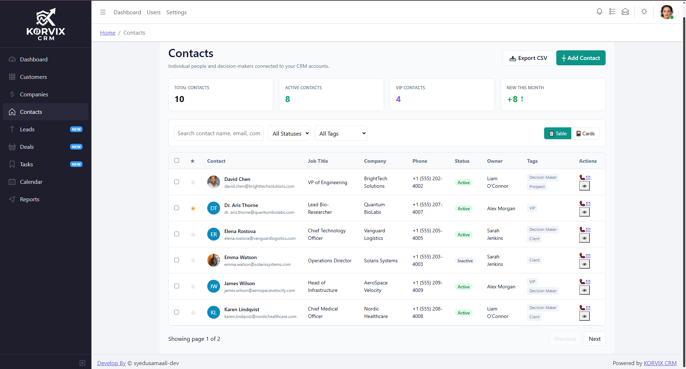
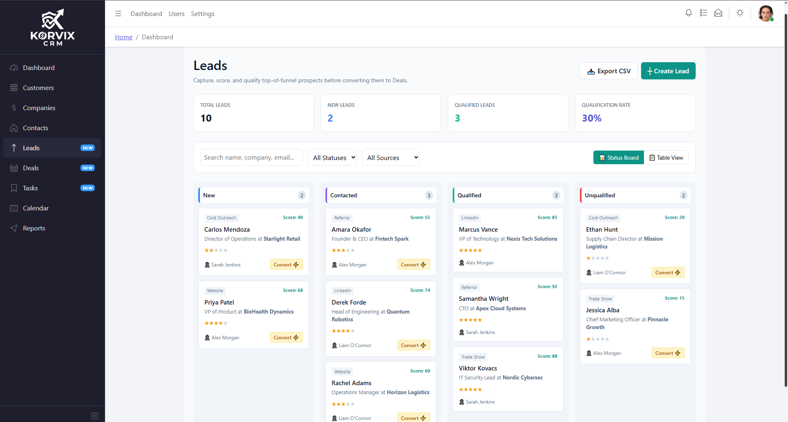
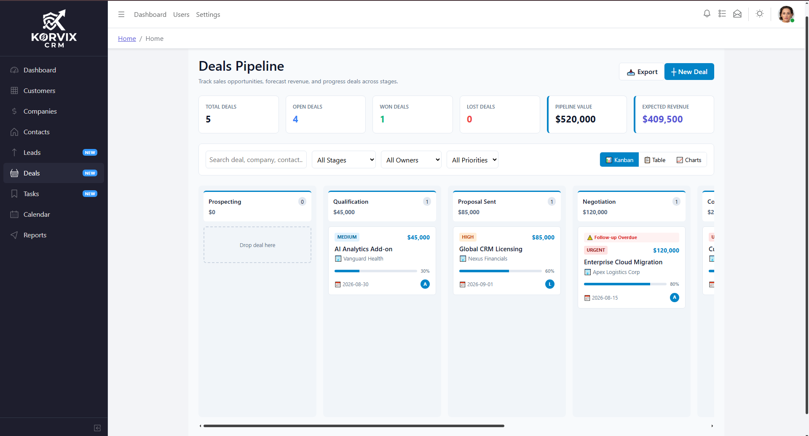
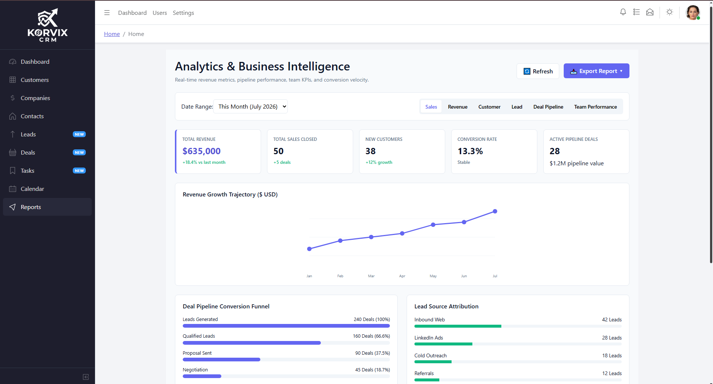

````markdown
# 🚀 Korvix CRM

A modern Enterprise CRM (Customer Relationship Management) system built with **Angular** and **Node.js**, designed with a scalable architecture and a professional SaaS interface.

> **Status:** 🚧 Frontend Development in Progress

---

## 🔗 Links

- **Repository:** https://github.com/Usama220/Korvix-CRM
- **Issues:** https://github.com/Usama220/Korvix-CRM/issues
- **Live Demo:** Coming Soon

---

## 📌 About

Korvix CRM is a portfolio project that demonstrates enterprise-level application development using modern web technologies.

The goal is to build a production-style CRM with a clean architecture, reusable components, responsive design, authentication, analytics, and AI-powered features.

---

## ✨ Planned Features

### Dashboard
- Business KPIs
- Revenue Analytics
- Customer Statistics
- Charts & Reports
- Recent Activities
- Quick Actions

### Customers
- Customer Management
- Search & Filters
- Customer Profile
- Activity Timeline
- Notes
- Documents

### Companies
- Company Management
- Company Profile
- Contacts
- Deals
- Documents

### Contacts
- Contact Directory
- Contact Details
- Email & Phone Information
- Timeline
- Notes

### Leads
- Lead Pipeline
- Lead Scoring
- Lead Sources
- Lead Conversion

### Deals
- Sales Pipeline
- Kanban Board
- Deal Stages
- Revenue Tracking

### Tasks
- Task Management
- Calendar Integration
- Priorities
- Reminders

### Calendar
- Meetings
- Events
- Follow-ups
- Daily / Weekly / Monthly View

### Reports
- Sales Reports
- Revenue Reports
- Customer Analytics
- Team Performance
- Export Reports

---

## 🛠 Tech Stack

### Frontend

- Angular
- TypeScript
- CoreUI
- Bootstrap
- SCSS
- RxJS

### Backend (Planned)

- Node.js
- Express.js
- MongoDB
- Mongoose
- JWT Authentication

### Tools

- Git
- GitHub
- Postman
- VS Code

---

## 📁 Project Structure

```text
src/
├── app/
│   ├── core/
│   ├── shared/
│   ├── layout/
│   ├── views/
│   │   ├── dashboard/
│   │   ├── customers/
│   │   ├── companies/
│   │   ├── contacts/
│   │   ├── leads/
│   │   ├── deals/
│   │   ├── tasks/
│   │   ├── calendar/
│   │   └── reports/
│   └── app.routes.ts
```

---
screeshot not displaying in preview fix this see my folder naming covention

## 📷 Screenshots

### Dashboard

<p align="center">
  
</p>

---

### Customers

<p align="center">
  
</p>

---

### Companies

<p align="center">
  
</p>

---

### Contacts

<p align="center">
  
</p>

---

### Leads

<p align="center">
  
</p>

---

### Deals

<p align="center">
  
</p>

---

### Tasks

<p align="center">
  
</p>

---

### Calendar

<p align="center">
  
</p>

---

### Reports

<p align="center">
  
</p>

---


## 🚀 Getting Started

### Clone the repository

```bash
git clone https://github.com/Usama220/Korvix-CRM.git
```

### Navigate to the project

```bash
cd Korvix-CRM
```

### Install dependencies

```bash
npm install
```

### Start the development server

```bash
ng serve
```

Open your browser and visit:

```text
http://localhost:4200
```

---

## 📈 Roadmap

- [x] Project Setup
- [x] Angular Integration
- [x] CoreUI Theme Integration
- [ ] Dashboard Module
- [ ] Customers Module
- [ ] Companies Module
- [ ] Contacts Module
- [ ] Leads Module
- [ ] Deals Module
- [ ] Tasks Module
- [ ] Calendar Module
- [ ] Reports Module
- [ ] Authentication
- [ ] Backend APIs
- [ ] MongoDB Integration
- [ ] Role-Based Access Control
- [ ] AI Assistant
- [ ] Deployment

---

## 🚀 Future Enhancements

- AI Chat Assistant
- Smart Lead Scoring
- AI Email Generator
- AI Meeting Summary
- Real-time Notifications
- File Management
- Activity Logs
- Dark Mode
- Multi-language Support
- Docker Support
- CI/CD Pipeline
- Email Integration
- SMS Integration
- Push Notifications
- Audit Logs
- Analytics Dashboard

---

## 🤝 Contributing

Contributions, suggestions, and feature requests are welcome.

If you'd like to improve Korvix CRM, feel free to fork the repository and submit a pull request.

---

## 📄 License

This project is licensed under the MIT License.

---

## 👨‍💻 Author

**Usama Ali**

GitHub: https://github.com/Usama220

Building **Korvix CRM** to showcase enterprise-level Angular, Node.js, and MongoDB development.
````
